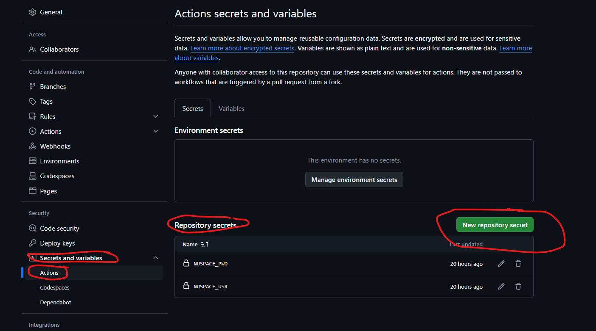
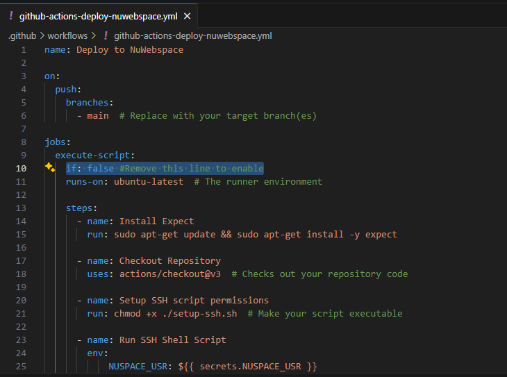

# Bonus status badge

# Deploy to nuwebspace automatically on push
add NUSPACE_USR and NUSPACE_PWD to Repository secrets

the action is disabled by default to enable the action remove this line 

from .github/github-actions-deploy-nuwebspace.yml